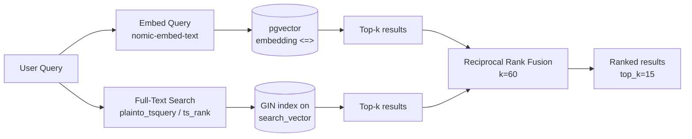

# Retrieval Pipeline

Hybrid search over SEC 10-K filing chunks using vector similarity (`pgvector`) + Postgres full-text search (FTS), fused with Reciprocal Rank Fusion (RRF).

## Architecture



## Default Settings

| Parameter | Default | Config key | Notes |
|---|---|---|---|
| `embedding_model` | `nomic-embed-text` | `embedding_model` | 768-dim embeddings via Ollama |
| `embedding_dimensions` | 768 | `embedding_dimensions` | Must match model output |
| `ollama_base_url` | `http://localhost:11434/v1` | `ollama_base_url` | OpenAI-compatible endpoint |
| `retrieval_top_k` | 15 | `retrieval_top_k` | Final fused result count |
| `retrieval_inner_top_k` | 20 | `retrieval_inner_top_k` | Per-strategy candidate pool cap |
| `retrieval_rrf_k` | 60 | `retrieval_rrf_k` | RRF smoothing constant (Cormack 2009) |

## Pipeline Steps

### 1. Embed Query (`retriever.py:53-62`)
The user query is embedded via Ollama's `/v1/embeddings` endpoint using `nomic-embed-text`. If embedding fails (Ollama down, network error), the pipeline **gracefully degrades** to full-text search only.

### 2. Semantic Search (`queries.py:56-63`)
Runs a pgvector cosine-distance query (`<=>` operator) against the `document_chunks.embedding` column:

```sql
SELECT ... 1 - (dc.embedding <=> %s::vector) AS score
FROM document_chunks dc
JOIN source_documents sd ON dc.document_id = sd.id
ORDER BY dc.embedding <=> %s::vector
LIMIT %s
```

The score is converted from distance to similarity (`1 - distance`). Returns up to `inner_top_k` results.

### 3. Full-Text Search (`queries.py:66-72`)
Runs Postgres full-text search using `plainto_tsquery('english', ...)` for query parsing and `ts_rank` for relevance scoring:

```sql
SELECT ... ts_rank(dc.search_vector, plainto_tsquery('english', %s)) AS score
FROM document_chunks dc
JOIN source_documents sd ON dc.document_id = sd.id
WHERE dc.search_vector @@ plainto_tsquery('english', %s)
ORDER BY score DESC
LIMIT %s
```

The `search_vector` column is a `tsvector` generated from `chunk_text`, indexed with a GIN index. Returns up to `inner_top_k` results.

### 4. Reciprocal Rank Fusion (`fusion.py:8-35`)
Combines the two ranked result lists using the RRF formula:

```
score(chunk) = Σ 1 / (k + rank_i(chunk))
```

- `k = 60` — standard smoothing constant from Cormack et al. 2009
- A chunk present in both lists gets a boosted score (two terms summed)
- Chunks appearing in only one list still contribute via their rank
- Results are sorted descending by fused score, truncated to `top_k`

### 5. Graceful Degradation
The retriever handles failures at each step:

| Failure Mode | Behavior |
|---|---|
| Embedding fails | Full-text search only |
| Semantic search fails | Full-text search only |
| Full-text search fails | Semantic search only |
| Both searches fail | Empty list returned |
| Both succeed | RRF fusion, `top_k` results |

## Data Flow

```
User Query: "What was Apple's revenue in 2025?"
    │
    ├─→ Embed via nomic-embed-text → [0.023, -0.145, ...] (768 floats)
    │   │
    │   └─→ pgvector cosine search → 30 candidates, scored [0.92, 0.87, ...]
    │
    ├─→ plainto_tsquery('english', ...) → tsquery
    │   │
    │   └─→ GIN-indexed ts_rank search → 30 candidates, scored [0.45, 0.31, ...]
    │
    └─→ RRF(k=60) → 15 fused results, alternating by rank
```

## SearchResult Dataclass

| Field | Type | Source |
|---|---|---|
| `chunk_id` | `str` | UUID from `document_chunks.id` |
| `chunk_text` | `str` | Raw text excerpt (up to 500 chars in tool) |
| `section` | `str \| None` | SEC section label (e.g. "Item 7") |
| `document_id` | `str` | FK to `source_documents.id` |
| `ticker` | `str` | e.g. "AAPL" |
| `company_name` | `str` | e.g. "Apple Inc." |
| `year` | `str` | e.g. "2025" |
| `score` | `float` | RRF fused score (final) or raw similarity/rank (pre-fusion) |

## Key Files

| File | Responsibility |
|---|---|
| `queries.py` | SQL queries + `SearchResult` dataclass |
| `fusion.py` | RRF algorithm |
| `retriever.py` | `DocumentRetriever` orchestrator with graceful degradation |
| `config.py` | `embedding_model`, `embedding_dimensions` |
